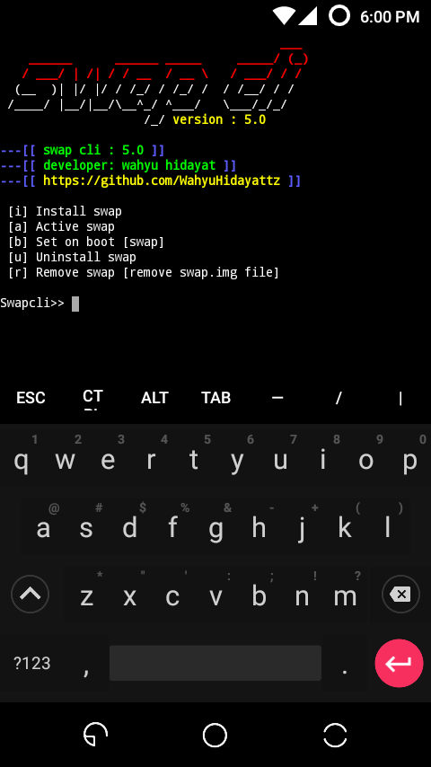

# SWAP-CLI ~ easy swap ram on any rooted android devices #

----

__What Is Swap-cli ?__

Swap-cli is a faster way to emulated your data partition into swap file. Swap file is a file with funchion for managing your apps / cache when running into ram.

----

__How To Swap-Cli ?__

How to swap-cli is a two way to using it.

__A. Manual by running the script__

- Download `swapcli.sh` and copy it to `sdcard`.

- Open `Terminal emulator` and type `su`

- After gor superuser permissions type `cd /sdcard`

- Type `sh swapcli.sh`

- And happy swapping

__Example on terminal :__

```
sprout@android:~$ su
root@android:~# cd /sdcard/
root@android:~# sh swapcli.sh
```

__B. Automatic by flashing swap-cli into recovery.__

- Download file `swapcli 4.0.zip` on link : <http://kuya/swapcli.zip>

- Flash into custom recovery

- Reboot ur phone

- Open Terminal emulator

- Type `su` and `swapcli`

__Example tutorial__

```
Flash swapcli.zip to custom recovery ex : TWRP/CWM
>> boot ur phone
>> Open Terminal Type

sprout@android:~$ su
root@android:~# swapcli
```

----

__Changelog :__

__swap-cli 4.0__

```
[+] Fixing some bugs 
[+] Add custom swap size 
[+] Add uninstall swap 
[+] Change style cli
```

__swap-cli 3.0__
```
[+] Removing useless feature 
[+] Simpling feature 
[+] Removing swap cache
[+] Swap data only
```

__swapcli 2.0__
```
[+] Adding swap cache 
[+] Adding eng & indo language 
[+] Fixing bug issue 
[+] Adding remove option 
[+] Adding active option 
```

__swapcli 1.0__
```
[+] Swap data size 128MB 
[+] Swap data size 256MB 
[+] Swap data size 512MB 
[+] Swap data size 1024MB 
[+] First swapCLI shell script
```

----

__Screenshots :__





